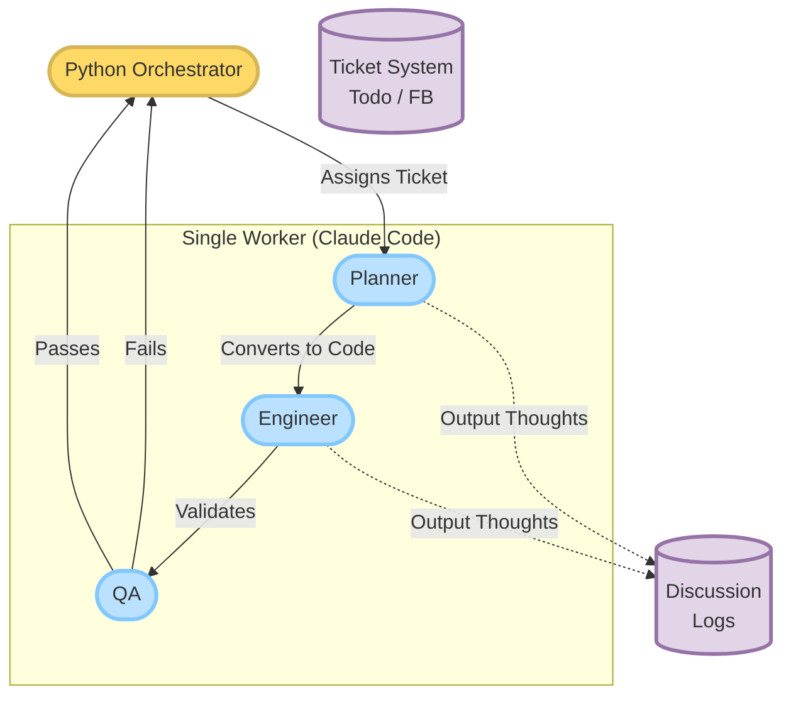

# はじめに

:::message
この記事は、AIエージェントとの対話を通じて半自動的に生成・執筆されたものです。
:::

前回の記事では、AIと人間の協働によるゲーム開発の限界と「AIへの過信（最悪のループ）」によるプロジェクト凍結について振り返りました。

しかし、その失敗は私たちに重要な教訓を与えてくれました。それは「**AI同士を無秩序に会話させるマルチエージェント構成は、ゲーム開発においては複雑性を爆発させ、最終的に崩壊を招く**」ということです。

そこで、今回新たに立ち上げた「WISDOMプロジェクト（完全自律型ゲーム開発スタジオ）」のv3.2アーキテクチャでは、複数のAIエージェントによる分業をあえて捨て、**「単一ワーカーのマルチペルソナ化」**という全く新しいアプローチを採用しました。

本記事では、24時間365日休まずゲームを作り続ける自律型AIスタジオの裏側と、人間が「ディレクター」としてどのように関わるべきか、その具体的なアーキテクチャと運用フローを解説します。

## 新アーキテクチャ（v3.2）：単一ワーカーのマルチペルソナ化

初期の構想では、「企画を考えるAI（Planner）」「コードを書くAI（Engineer）」「テストを行うAI（QA）」という独立したエージェントを用意し、それぞれを連携させる予定でした。しかし、AI同士のコミュニケーションロスや「できると言い張る過信」が連鎖し、すぐに環境が崩壊してしまいました。

そこで辿り着いたのが、「**1つのClaude Codeが、文脈に応じて自らの役割（帽子）を被り直す**」という手法です。

この構成の最大のメリットは、**「コンテキストの分断」が起きない**ことです。
Plannerとして要件を定義したClaudeが、そのままEngineerとしてコードを書き、QAとしてテストを実行します。複数のエージェントを仲介するオーバーヘッドが消滅し、エラーが発生した際の自己修復（Self-BU）も1つのコンテキスト内で完結するため、圧倒的な安定性を実現しました。

## 自律稼働を支える基盤（CI/CD・チケットオーケストレーター）

単一のClaude Codeを24時間自律稼働させるために、司令塔となる軽量なPythonスクリプト（`orchestrator.py`）を実装しました。

このオーケストレーターは、以下のサイクルを無限に回し続けます：
1. `Tickets/todo/` フォルダを監視し、新しいタスクがあればClaudeに実行を指示する。
2. Unityのバックグラウンド実行（CUI制御）を行い、自動テストスクリプトを走らせる。
3. エラーが出れば、ログをClaudeに渡して自己修復ループを回す。
4. 全テストをパスすれば、Gitへ自動でコミットする。

### 思考の透明化：DiscussionLogs
この自律稼働において最も重要視したのが、「**AIの実装前の思考プロセスを可視化すること**」です。
オーケストレーターは、Claudeがコードを書き始める前に、必ず `Tickets/DiscussionLogs/` に「内部議論ログ」を出力させます。

これにより、翌朝人間が起きてきたときに「AIが夜間に何を考えてその実装に至ったのか」を、まるで台本を読むように遡ることができます。ブラックボックス化を防ぐための重要な監査機能です。

*イラスト：単一のAIワーカーがオーケストレーターの指揮下で役割を切り替えながら開発を進める様子*

## 人間の役割：ディレクターとしての4つのタッチポイント

AIが自律的にタスクを消化していく中で、人間（ユーザー）は「コードを書く」という作業から完全に解放されます。
その代わり、人間は「体験のレビュー」と「方向性の決定」という、ディレクターとしての本来の役割に専念します。

具体的には、以下の**4つのタッチポイント**でのみ介入を行います。

1. **企画書のレビュー（FB）**
   - AIが自律的に立案したゲームの企画書や新機能の仕様書（Markdown）を読み、OK/NGや修正指示を出します。
2. **テストプレイ動画のレビュー（FB）**
   - AIが自動テスト（AutoPlayer）を実行した際のプレイ動画を確認し、「ジャンプの軌道がおかしい」「もっとエフェクトを派手にして」といった視覚的・感覚的なフィードバックを与えます。
3. **直接のテストプレイと感覚のフィードバック**
   - 人間自身が実際にUnity上でゲームをプレイし、AIには分からない「手触り」や「気持ちよさ」を言語化して伝えます。
4. **組織全体の方向性指示**
   - 「次はアクションではなくパズル要素に注力しよう」など、スタジオ全体の大きな方針を決定します。

*イラスト：人間は実装を行わず、レビューとディレクションに特化する次世代の開発体制*

## おわりに

「完全自律型AIゲーム開発スタジオ」の構築は、人間がコードやバグに縛られることなく、純粋に「面白い体験とは何か」に向き合うための挑戦です。

まだ「AIが本当に面白いゲームを作れるのか」という究極の問いに対する答えは出ていません。しかし、作業をAIに完全に移譲し、人間がレビューに特化するこの「v3.2アーキテクチャ」は、確かな手応えを感じさせてくれています。

今後はこのオーケストレーターを本格稼働させ、AIが立案した企画がどのようにゲームとして具現化されていくのか、その実証実験を進めていきます。
