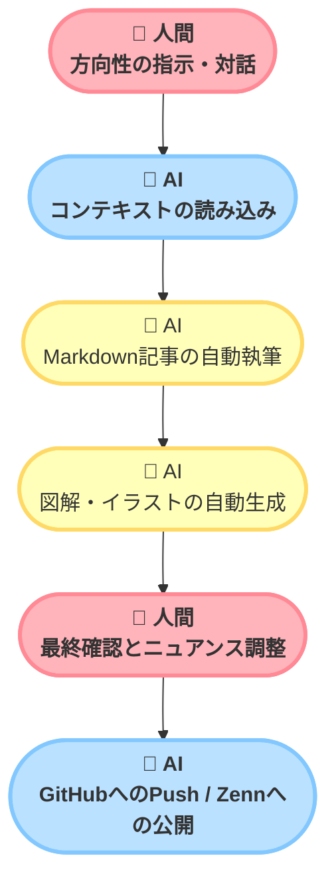

# はじめに

ゲーム開発など、長期間にわたるプロジェクトでは「振り返り（ポストモーテム）」を行い、得られた知見を言語化することが非常に重要です。しかし、いざ記事としてまとめようとすると、 **執筆にかかる時間と労力のコスト** が大きな壁となり、後回しにされてしまうことが少なくありません。

そこで立ち上げたのが、AI（Claude CodeやAntigravity等のエージェント）との対話を通じて、開発記録や振り返り記事を半自動で生成するプロジェクト **「Clio」** です。

本記事では、このClioプロジェクトで実践している「AIとの二人三脚による技術記事執筆ワークフロー」の裏側と、実践して分かったノウハウをご紹介します。

## AIと二人三脚の「半自動」執筆ワークフロー

Clioにおける記事作成プロセスは、人間がゼロから文章を書くのではなく、 **「人間が方向性を指示し、AIが文脈を汲み取って執筆する」** というアプローチを取っています。

### 1. 対話とコンテキスト共有
記事を作成する際、まずはAIに対して「どんなプロジェクトだったか」「何が問題だったか」をチャットベースで伝えます。AIは過去の開発ログやリポジトリ内の情報を読み込み、散らばった知見を一つのストーリーにまとめ上げます。

### 2. Markdown形式での直接執筆
Zennなどの技術ブログプラットフォームで公開することを前提とし、AIには直接Markdown形式でファイルを出力させます。フロントマター（タイトル、絵文字、タグなど）の設定も自動化しているため、後から手作業でフォーマットを修正する手間が省けます。

### 3. GitHubへの自動プッシュ
完成した記事は、AIが自身でGitコマンドを実行し、リポジトリにコミット＆プッシュします。これにより、ターミナルを開くことなく、チャット上での承認のみでバージョン管理が完結します。

## 視覚的アプローチの自動化（ここがポイント！）

文字ばかりの技術記事は読みにくくなりがちです。Clioでは、記事をより魅力的にするために **視覚表現もAIによって自動化** しています。

1. **ポップなMermaid図解の生成**
   技術的なフローチャートも、ただの白黒の箱ではなく、角丸（`rx:20px, ry:20px`）やパステルカラーを用いたクラス定義（`classDef`）を適用し、インフォグラフィック風に仕上げています。
2. **アイキャッチイラストの自動生成と配置**
   画像生成AIを活用し、記事のテーマに合ったイラストを自動で作成します。この時、記事を開いた際に画面を埋め尽くしてしまわないよう、 **「アスペクト比は16:9の横長」** とし、 **「読了後の文末（おわりにの直下）に配置する」** という明確なルールを定めています。

## この運用のメリットと課題

このワークフローを実践することで、執筆の心理的ハードルは劇的に下がり、開発の振り返りを迅速に行えるようになりました。
人間は「何を伝えたいか」という根幹のディレクションと、AIが生成した文章に対する「最終的な手触り・感情表現の調整」にのみ集中することができます。

一方で、AIは事実の羅列や論理的な構成は得意ですが、「その時どれほど悔しかったか」といった感情的で人間臭いニュアンスは抜け落ちがちです。そこを人間が最後に加筆することで、より魂の入った記事に仕上がります。

## おわりに

「Clio」プロジェクトを通じて確立したこの執筆フローは、ゲーム開発のみならず、あらゆる個人開発や技術ブログの運用において強力な武器になると確信しています。

これからも、人間とAIの最適な距離感を模索しながら、効率的かつ魅力的な発信を続けていきます。

*イラスト：人間とAIが協力して記事やドキュメントを作り上げる執筆環境*
