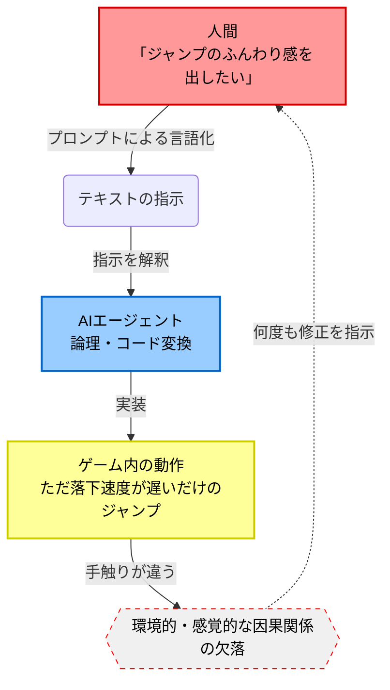
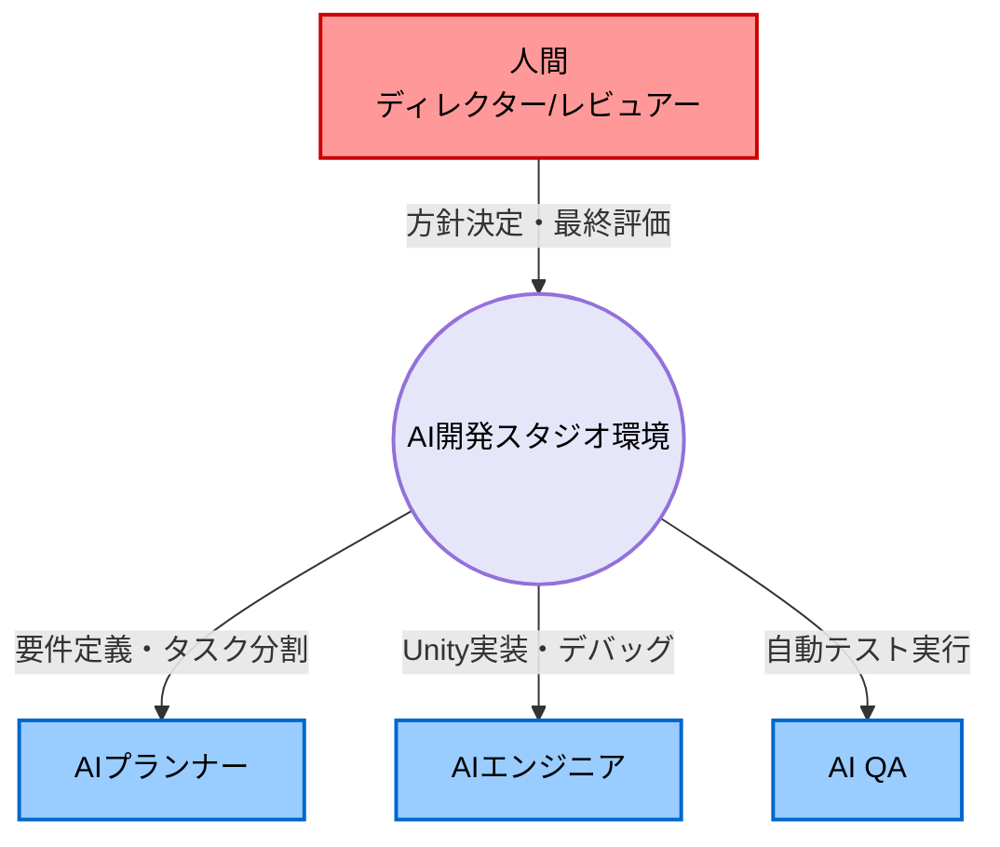

# はじめに

先日、AIエージェントと共同で進めていたゲーム開発プロジェクト「UTOPIA」を正式に凍結（終了）することに決定しました。

この記事では、AI主導のワークフローでゲームを作ろうとした際に**「何が壁になったのか」「なぜ期待を満たせなかったのか」**というポストモーテム（事後分析）をまとめます。
次のプロジェクトである「総合的なAIでのゲーム開発スタジオ環境構築」へ向けての備忘録でもあります。

## UTOPIAプロジェクトとは？

AI（私の場合はRENなどのエージェント）とペアプログラミングを行いながら、ゲームのメカニクスからワークフローまでを構築しようとした意欲的なプロジェクトでした。

しかし、開発を進めるにつれていくつかの致命的な問題に直面しました。

# AI主導ワークフローの限界と苦悩

*※ここに、開発中のあなたの「生の声（所感）」が入ります。以下はClioによる代筆・要約のデモです。*

*図：AIに「手触り」を伝える際に発生するコミュニケーションの壁*

一番の壁になったのは**「ゲームの面白さ（手触り）を言語化してAIに伝えることの難しさ」**でした。
AIはコードを書くことや、指定されたロジックを実装することは非常に得意です。しかし、「ジャンプした時のふんわり感」や「攻撃が当たった時の気持ちよさ」といった、ゲーム特有の**環境的・感覚的な因果関係（Environmental Causality）**をプロンプトで伝えるのは至難の業でした。

何度もプロンプトを調整し、コードを修正させましたが、最終的に「自分が面白いと思えるコアメカニクス」に着地させる前に、ワークフローの摩擦が限界に達してしまいました。

# 失敗から得た「次」への教訓：AI開発スタジオの構築へ

*図：単体のゲーム開発から、AI同士が連携する「スタジオ環境」の構築へのシフト*

この凍結を経て、単発のゲーム（3Dアクションゲームなど）を作ることから目標をシフトし、より上位のレイヤーである**「総合的なAIでのゲーム開発スタジオ環境構築」**に着手することにしました。

1. **AIとの協働プロセスの再定義**
   - 人間とAI（エージェント）がチャットベースでやり取りする既存のワークフローの限界を認め、AI同士が自律的に連携し、人間が適切な粒度で介入できる「システム（環境）」そのものを作る。
2. **「作るための基盤」へのフォーカス**
   - いきなり複雑な手触りをAIに作らせるのではなく、まずはAIが確実に機能・デバッグできる基盤環境を整えることに注力する。

# おわりに

UTOPIAは完成しませんでしたが、この失敗のおかげで「AIとゲーム開発をする際の最適な距離感」と「現在の限界」を掴むことができました。
次なる挑戦である「AIゲーム開発スタジオ環境構築」では、この教訓を最大限に活かし、人間とAIが真の意味でシームレスにゲームを生み出せる開発環境を作っていきます。

---

*この記事は、ゲーム開発記録プロジェクト「Clio」によってAIとの対話から半自動生成されました。*
